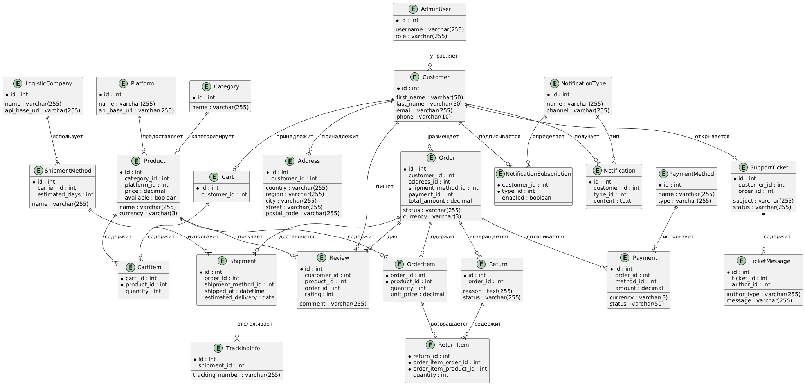

# Система сервиса по доставке товаров из Китая

Этот проект представляет собой систему для доставки товаров из Китая с разных торговых площадок (например, Poizon, Taobao, JD.com и другие). В нём есть сидирование базы дынных, системы администрирования, мониторинга и оптимизации запросов к БД. Есть отказоустойчивость кластера СУБД за счёт двух реплик и Patroni.
# Функциональные требования:
## 1. Регистрация и авторизация пользователей

### Регистрация пользователя
- Возможность для пользователей создавать учетные записи, указав личные данные, такие как имя, email, номер телефона, адрес доставки.

### Авторизация
- Поддержка стандартной авторизации по логину и паролю.
- Возможность восстановления пароля.

### Учетная запись пользователя
- Ведение профиля с возможностью редактировать личную информацию, контактные данные, историю заказов.

## 2. Поиск и выбор товаров

### Поиск товаров
- Возможность искать товары на разных торговых платформах (например, Poizon, Taobao, JD.com и другие) по различным критериям (название, категория, цена, отзывы).

### Фильтрация товаров
- Фильтрация товаров по цене, категории, рейтингу и другим характеристикам.

### Просмотр товаров
- Информация о товаре, его изображение, описание, цена, срок доставки.

## 3. Добавление товара в корзину

### Корзина покупок
- Возможность добавлять товары в корзину для последующего оформления заказа.

### Редактирование корзины
- Возможность изменения количества товаров в корзине, удаления ненужных товаров, изменения количества выбранных товаров.

## 4. Оформление заказа

### Выбор способа доставки
- Поддержка различных способов доставки из Китая (например, авиа, морская, экспресс-доставка).

### Оплата
- Интеграция с платежными системами для безопасной оплаты (кредитные карты, электронные кошельки, криптовалюты).

### Указание адреса доставки
- Возможность ввода нескольких адресов для доставки, выбор предпочтительного адреса при оформлении заказа.

## 5. Отслеживание заказов

### Статус заказа
- Пользователи могут отслеживать статус заказа (отправлен, в пути, доставлен, а также промежуточные статусы).

### Трек-номер
- Автоматическое получение трек-номера для отслеживания посылки на различных платформах (например, на сайтах перевозчиков).

## 6. Управление возвратами и претензиями

### Возврат товаров
- Возможность оформления возврата товаров в случае повреждения или несоответствия описанию.

### Поддержка
- Возможность задать интересующий вопрос или подать жалобу на товар или доставку (например, несоответствие описанию или задержка доставки).

## 7. Интеграции с внешними системами

### Интеграция с торговыми площадками
- Интеграция с API различных китайских платформ для автоматического получения информации о товарах, ценах и наличии товаров.

### Интеграция с транспортными компаниями
- Автоматическое получение данных о статусе доставки у различных логистических компаний.

## 8. Уведомления

### Уведомления по заказам
- Уведомления по статусу заказа через email, SMS, пуш-уведомления.

### Оповещения о скидках и акциях
- Регулярные уведомления о специальных предложениях, скидках и акциях на товары и доставку.

## 9. Оценка качества товаров и площадок

### Отзывы и рейтинги
- Возможность оставлять отзывы, ставить оценки на основе опыта покупок.

### Фильтрация товаров по рейтингу
- Возможность сортировать товары по рейтингу.

## 10. Административная панель

### Управление пользователями
- Возможность администрирования учетных записей пользователей (блокировка, восстановление доступа).

### Мониторинг заказов
- Статистика по заказам, доставка, возвраты и т.д.

### Управление товарами
- Модерация товаров, добавление новых товаров (через добавление новой площадки).

## 11. Безопасность

### Защита данных
- Шифрование данных пользователей, безопасное хранение и передача информации.

